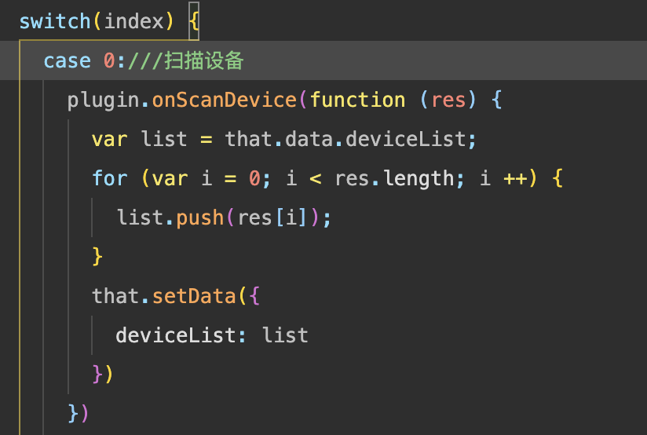
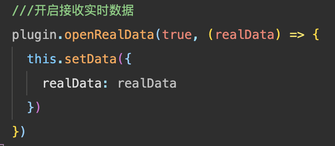

# 柔灵小程序插件文档

文档链接：https://mp.weixin.qq.com/wxopen/plugindevdoc?appid=wx5c4a700b9e5facd7&token=1515015640&lang=zh_CN

## 购买柔灵产品
开发者可联系业务人员购买柔灵肌电产品与脑电产品。

## 生成 App Key
每个应用程序都需要一个唯一的应用程序密钥(App Key)来初始化SDK。
获取方式：请联系业务人员获取

## 接口参数
插件中定义了一个主要的对象类型，其结构为：
deviceModel: {},///数据类型：{deviceName: device.name, isConnected:false, mac:"", deviceId:device.deviceId, serviceId:"", readCharacteristicId:"", writeCharacteristicId:"", flexModel:flexModel}

## 使用接口
### 1、扫描设备
调用 plugin.onScanDevice(function(res)), function(res) 为回调函数，代表扫描到的设备列表，设备列表的元素为 deviceModel，具体参见 Demo index.js

### 2、停止扫描
调用 plugin.onStopScanDevice(), 调用后会停止扫描设备，该方法会调用 wx 的 stopBluetoothDevicesDiscovery 函数
### 3、连接设备
调用 plugin.onConnectDevice(bleModel, function(res)), 参数 bleModel 为设备对象 deviceModel，function(res) 为连接后的回调函数，具体参见 Demo index.js
### 4、断开设备连接
调用 plugin.onDisconnectDevice(bleModel, function(res)), 参数 bleModel 为设备对象 deviceModel，function(res) 为连接后的回调函数，具体参见 Demo index.js
### 5、实时数据监听
调用 plugin.openRealData(openReal, function (realData)), 参数 openReal 为布尔型，传入 true 将开始实时数据监听，参数 function (realData)，为实时数据监听的回调函数，每五秒回调1次，共1250条脑电数据。

### 6、实时滤波数据监听
调用 plugin.openFilterRealData(openFilterReal, func (realData)), 参数 openFilterReal 为布尔值型，传入 true 将开始实时滤波数据监听，参数 function (realData)，为实时滤波数据监听的回调函数，每五秒回调1次，共1250条脑电数据。
### 7、是否佩戴设备
调用 plugin.isWear(bleModel), 会返回是否佩戴的值
### 8、是否连接设备
调用 plugin.isConnected(bleModel), 将返回是否已经连接了设备，调用 wx.getBLEDeviceRSSI，异步后会将信号强度写入 bleModel，建议间隔一定时间后延迟读取 bleModel.RSSI
### 9、信号强度
调用 plugin.getDeviceRRSI(bleModel), 将返回设备当前的信号强度，单位 dBm
### 10、设备电量
调用 plugin.getBattery(bleModel), 将返回设备当前的电量，取值为0-100
### 11、截取一段数据，5秒
调用 plugin.startPickupData(), 将返回一段5秒的脑电数据，共1250条
### 12、设置滤波参数
调用 plugin.filterParam(order, hp, lp), 设置滤波参数， order-滤波阶数，hp-高通，lp-低通，设置该函数后，会作用于返回的实时滤波数据

